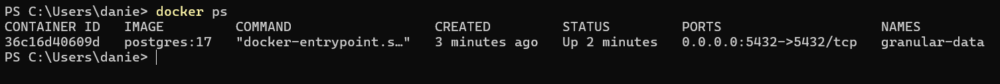
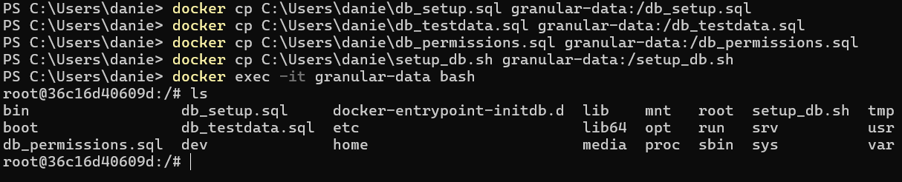
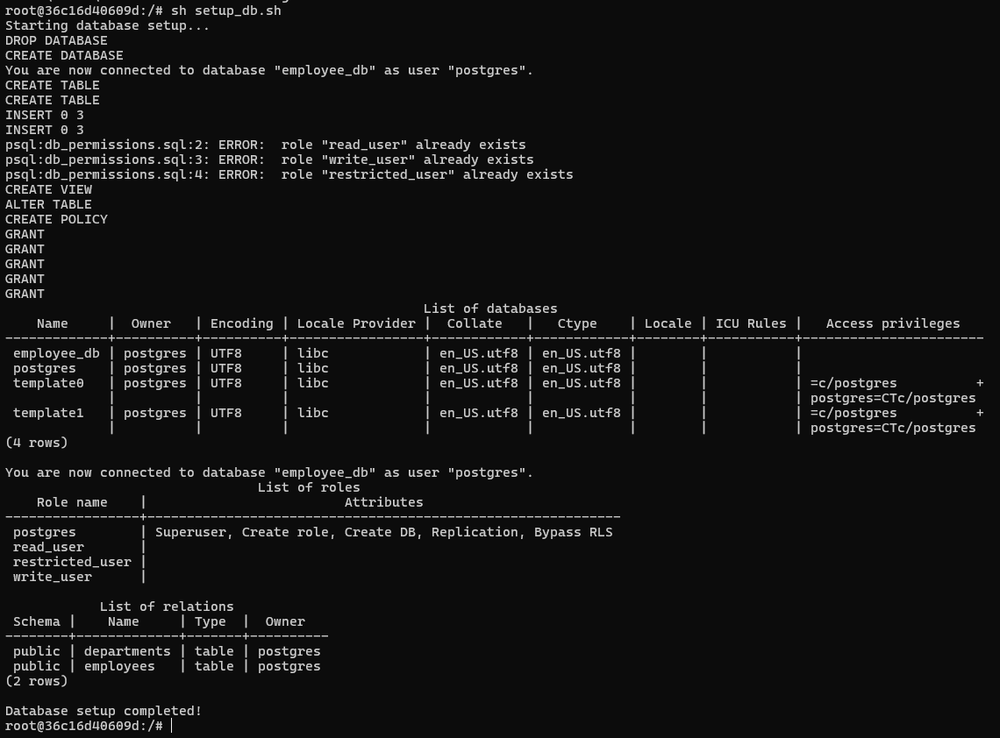
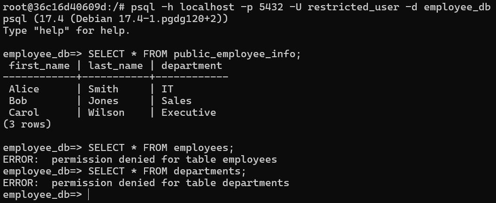
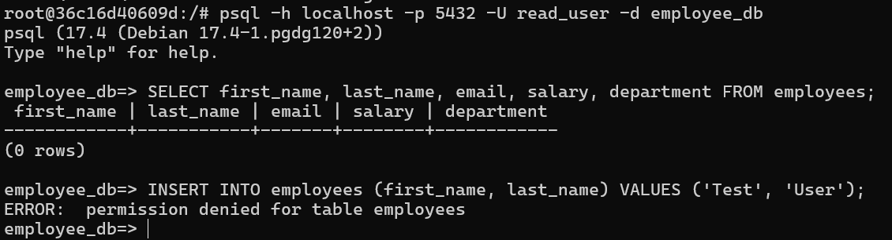
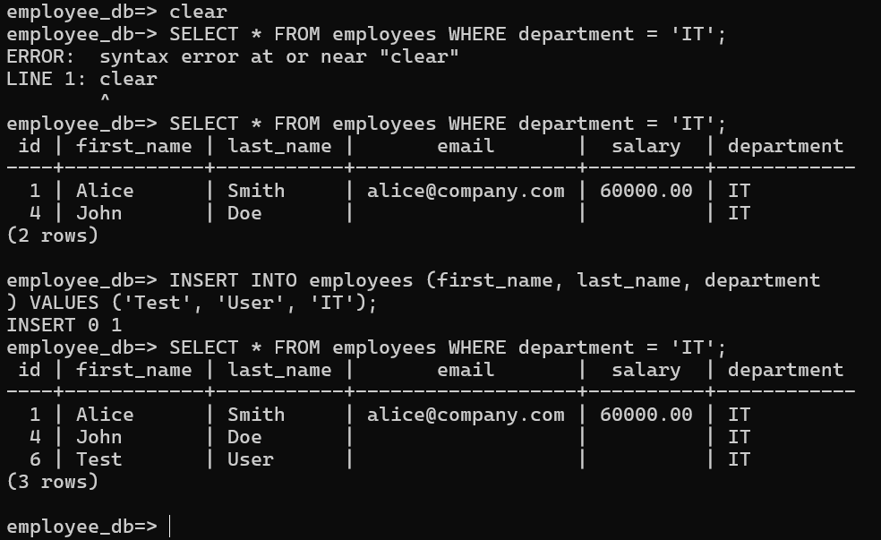

# Integrator Documentation

---

### Repository  
[System Integration Course – Assignment 04b](https://github.com/sami0880-kea/system_integration_course/tree/main/00._Assignments/04b._database_granular/01._exposee)

---

## Role: Integrator

---

### Prerequisites

Make sure the following are installed:

- Docker  
- PostgreSQL

---

## Connecting

> After pulling the PostgreSQL Docker image, the container is now running and ready for use.

---

## Initializing the Database

> The setup requires copying SQL and shell scripts into the container. These scripts will initialize the database schema, insert test data, and assign role-based permissions.

> Executing the shell script runs all SQL files in sequence, preparing the database with tables, test data, and three users: `restricted`, `read`, and `write`.

---

## Testing Access Levels

### Restricted User

> After logging in as the `restricted` user, I was able to view data from the `public_employee_info` view.  
> Attempting to select from the `employees` and `department` tables returned permission errors — as expected for this role.

---

### Read User

> The `read` user successfully viewed all data in the `employees` table.  
> However, inserting data into `employees` was denied due to lack of write permissions.

---

### Write User

> As the `write` user, I could both read from and insert into the `employees` table.  
> This confirms the role-based access control is correctly configured.

---

## Result

The database was successfully initialized inside the container.  
All three user roles (`restricted`, `read`, `write`) behaved as expected:

| Role        | Can View Employees | Can Insert Employees | Can View Public Info |
|-------------|--------------------|-----------------------|-----------------------|
| restricted  | ❌                 | ❌                    | ✅                    |
| read        | ✅                 | ❌                    | ✅                    |
| write       | ✅                 | ✅                    | ✅                    |

---

## Conclusion

The setup worked as intended and the documentation is easy to follow.